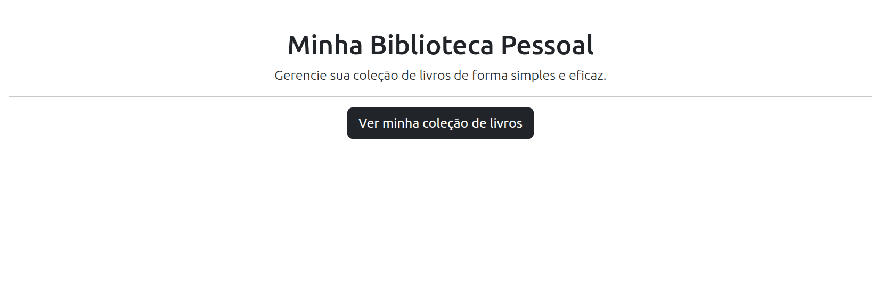
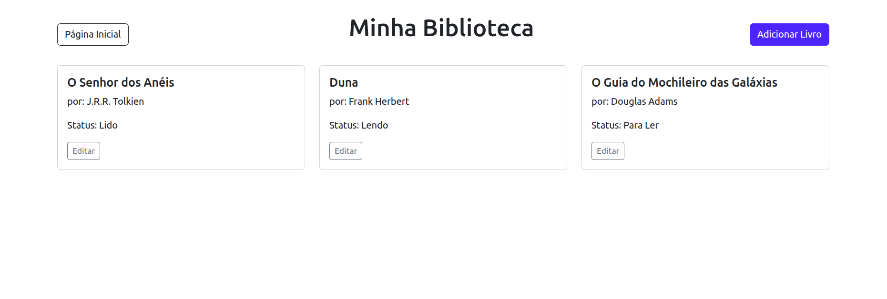
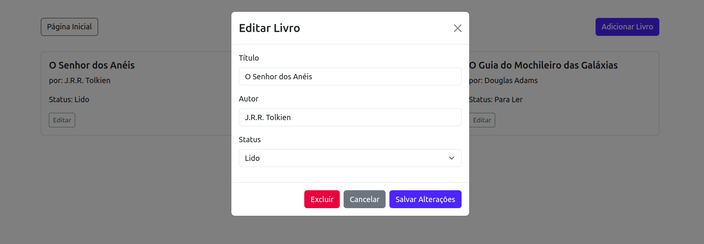
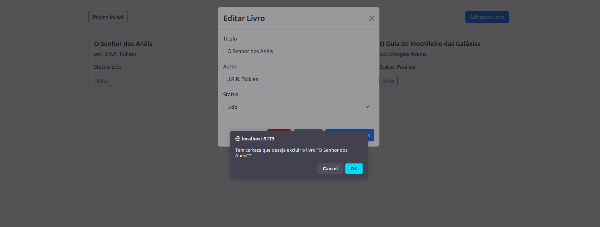
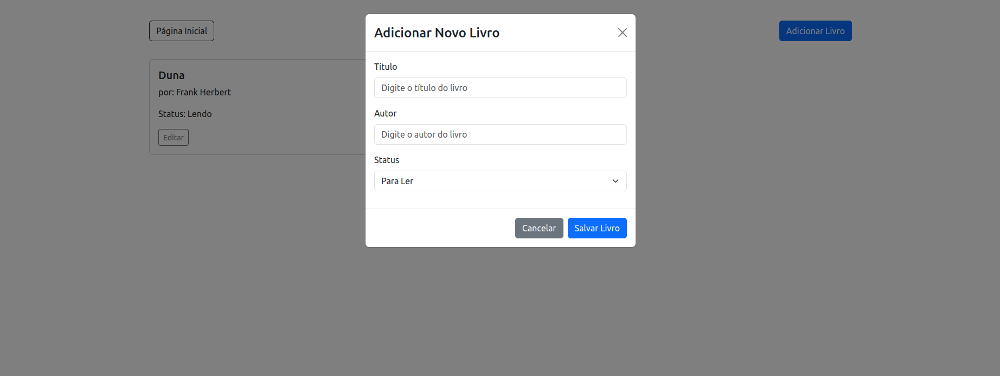

# Minha Biblioteca

Uma aplicação web simples para navegar e gerenciar uma coleção de livros localmente no navegador.

## O que ela faz
- Exibe uma lista de livros.
- Mostra informações básicas dos livros (título, autor, capa).
- Inserir livros.
- Editar livros.
- Remover livros.
- Navegação entre a página inicial e a lista de livros.

 

## Funcionalidades
- Listagem de livros
- Visualização de detalhes do livro 
- Edição de livro
- Remoção de livro
- Navegação entre páginas
 

## Como baixar
1. Clone o repositório:
   
   `git clone <repo-url> minha-biblioteca`
 
2. Acesse a pasta do projeto:
   
   `cd minha-biblioteca`
 

## Como executar (usuário final)
1. Instale dependências:
   - npm: `npm install`
   - yarn: `yarn`
   - pnpm: `pnpm install`
2. Rode em modo de desenvolvimento:
   - npm: `npm run dev`
   - yarn: `yarn dev`
   - pnpm: `pnpm dev`
3. Abra o navegador em:
   - http://localhost:5173

## Exemplos de uso (passo a passo)
- Abra o navegador em "http://localhost:5173" (vide seção "Como executar"):

- Navegar para "Lista de Livros" (menu/rota) para ver todos os livros carregados:

- Clicar "editar" para editar um livro:

- Clicar em "excluir" para apagar um livro:

- Clicar em "adicionar" para adicionar um livro:

 
 

## Próximos passos
- Implementar a busca por livros

 
 

## Para desenvolvedores

### Requisitos técnicos
- Node.js 18+ recomendado
- npm / yarn / pnpm
- Vite + React (ja configurado no projeto)

### Estrutura principal do projeto
- /src
  - App.jsx — Componente raiz
  - main.jsx — Entrada da aplicação (render)
  - index.css — Estilos globais
  - /assets — Imagens e recursos estáticos
  - /components — Componentes reutilizáveis
  - /pages
    - HomePage.jsx — Página inicial
    - BookList.jsx — Página/lista de livros

### Scripts úteis
- Dev: `npm run dev` — Inicia o servidor de desenvolvimento (HMR)
- Build: `npm run build` — Gera build de produção em `dist/`
- Preview: `npm run preview` — Serve o build para testes locais
- Lint: `npm run lint` — (Se configurado) verifica estilo/codificação

### Como desenvolver
- Adicione novas páginas em `src/pages/` e importe/roteie em App.jsx.
- Componentes reutilizáveis em `src/components/`.
- Estilos: `src/index.css` para globais; use CSS Modules ou styled-components para estilos locais.
- Testes: adicione testes unitários (ex.: Jest / Vitest) conforme necessário.

### Build e deploy
- Gere o build: `npm run build`
- Teste local: `npm run preview`
- Hospede `dist/` em qualquer servidor estático (Vercel, Netlify, S3, GitHub Pages).

### Dicas e troubleshooting
- Se o dev server não subir, verifique `node -v` e as mensagens no terminal.
- Verifique o console do navegador para erros de runtime.
- Remova cache de dependências com `rm -rf node_modules && npm install` se houver comportamento estranho.

### Contribuição
- Abra issues para bugs e features.
- Faça PRs pequenas e descritivas.
- Mantenha o padrão de código do projeto.

---
Atualize este README conforme novas funcionalidades forem adicionadas à aplicação.
